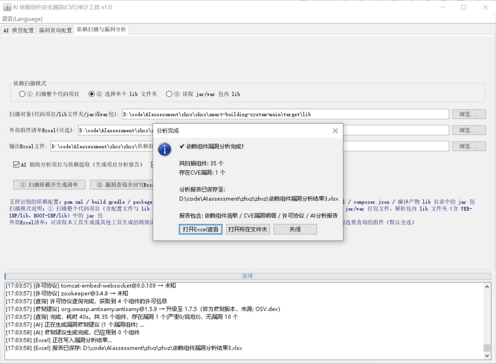
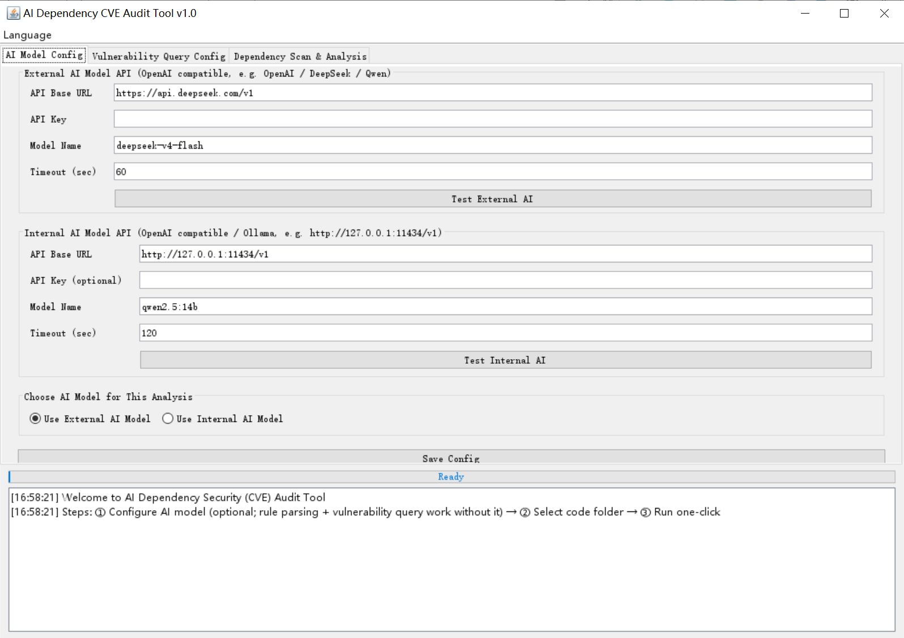
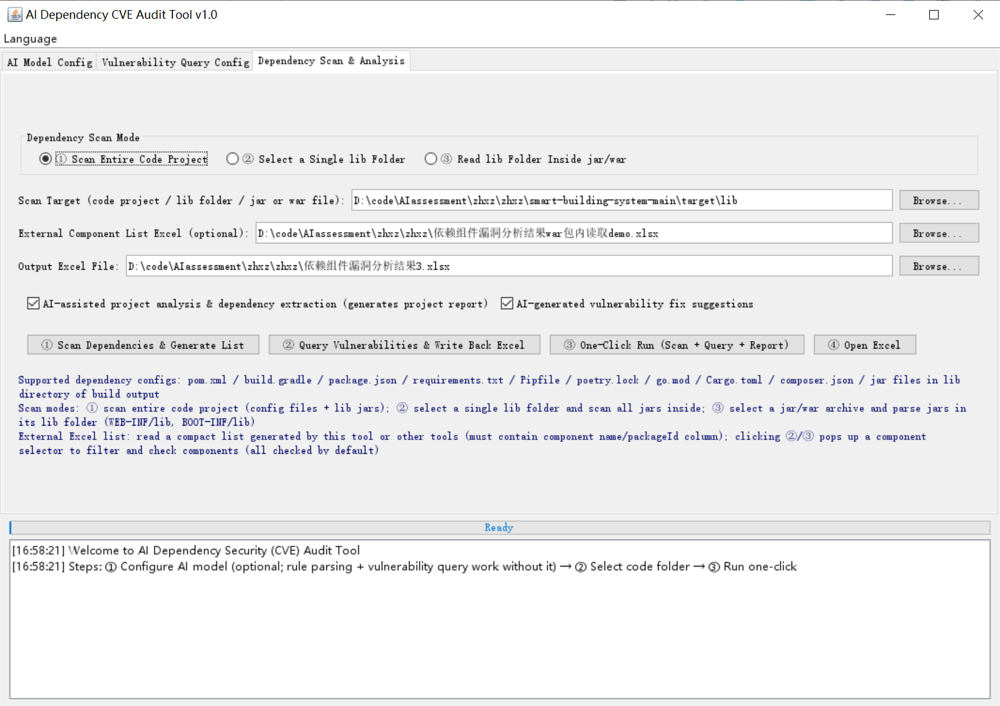
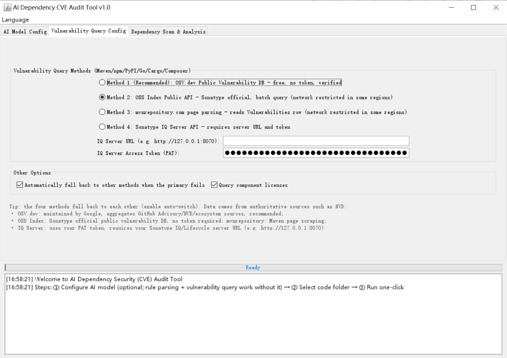

# Open Source Software SCA - Software Supply Chain Component Vulnerability Scanner

> **Free · Open Source · AI-Assisted Software Composition Analysis (SCA) Tool**
>
> 🌐 **Language**: [简体中文](README.md) · [English](README.en.md) · [Français](README.fr.md) · [日本語](README.ja.md)

A completely free, open-source Software Composition Analysis (SCA) tool that uses AI to audit open-source components in the software supply chain for security vulnerabilities. Through its Swing GUI, select a code folder written in Java / Python / Node.js / Go / Rust / PHP, and it automatically detects the project's dependency configurations (pom.xml, build.gradle, package.json, requirements.txt, poetry.lock, go.mod, Cargo.toml, composer.json, jar files under lib, etc.), generates a dependency Excel list, queries CVE vulnerabilities and licenses for every component, writes the results back into the Excel file, and finally shows a completion dialog from which you can open the Excel directly.

**Four-language support (i18n)**: the UI, log output and Excel output (sheet names / headers / status values) switch instantly between Simplified Chinese, English, Français and 日本語; your choice is persisted automatically and restored on the next launch.

## Features

- **Internationalization (i18n)**: UI, log pane and Excel output (sheet names / headers / status values) support four languages — Simplified Chinese, English, Français, 日本語. Switch anytime via the "Language / Langue" menu; the selection is saved automatically.
- **AI model API configuration**: configure an "External AI API" and an "Internal AI API" (OpenAI-compatible protocol) separately, with any baseUrl / apiKey / model name, plus a one-click connection test.
- **AI project analysis**: AI reads the folder structure and dependency list, produces a project analysis report, and adds dependencies not covered by the parsing rules.
- **Three dependency scan modes**:
  1. **Scan the entire code project** — automatically detects dependency configs and extracts "component (packageId) / version / language / introduction type":
     - Java: `pom.xml` (including `${property}` version-variable resolution), `build.gradle`, compiled jars under `lib` (reading META-INF/maven pom.properties / pom.xml)
     - Node.js: `package.json` (dependencies / devDependencies, etc.)
     - Python: `requirements.txt`, `Pipfile`, `poetry.lock`
     - Go: `go.mod`; Rust: `Cargo.toml`; PHP: `composer.json`
  2. **Select a single lib folder** — scans all jars inside the chosen folder directly.
  3. **Read a jar/war archive** — parses jars in the archive's lib folder (`WEB-INF/lib`, `BOOT-INF/lib`).
- **External Excel component list**: import a component list generated by this tool or other tools (a component-name column is required); a component selector dialog pops up with keyword filtering and checkboxes (all checked by default).
- **Four CVE query channels** (pick any; automatic fallback on failure):
  1. **OSV.dev (recommended)**: Google-maintained public vulnerability database, free with no token, aggregating GitHub Advisory / NVD and other authoritative sources
  2. **OSS Index**: Sonatype public component database (POST /api/v3/component-report)
  3. **mvnrepository**: parses the Vulnerabilities table of `https://mvnrepository.com/artifact/{groupId}/{artifactId}/{version}`
  4. **Sonatype IQ Server**: enterprise API (POST /api/v2/components/details) using your PAT token
- **Vulnerability write-back to Excel**: vulnerable or not, CVE ID list, max severity (Critical / High / Medium / Low), CVSS score and affected/fixed version ranges per CVE, component license (Maven Central POM / npm registry / PyPI / crates.io / Packagist).
- **AI fix suggestions (official-API fallback)**: optionally let AI generate upgrade suggestions for vulnerable components; when AI is unavailable, the official fix versions returned by the vulnerability API are used automatically; the last Excel column records the suggestion retrieval date (the API read date) so you can trace the validity of suggestions if fix versions change later.
- **Completion dialog**: after analysis, choose "Open Excel / Open folder / Close".

## Excel Output

The generated Excel file (`.xlsx`) contains 3 worksheets:

| Worksheet | Content |
| --- | --- |
| Dependency List | component (packageId), version, language, introduction type, vulnerable?, vulnerability count, max severity, CVE IDs, license, AI fix suggestion, official API fix suggestion, suggestion date, query method, status (rows colored red/green by severity) |
| CVE Details | CVE ID, title, description, CVSS score, severity, affected version ranges, reference link per vulnerability |
| AI Project Analysis | overall AI analysis and fix suggestions for the project |


    


## Requirements

- JDK 1.8+ (the project is written in Java 8 syntax)
- No Maven needed to run (use the packaged jar); Maven 3.6+ is required only to rebuild

## Quick Start

### Option 1: Run directly (recommended)

```bat
run.bat
```

Or manually:

```bat
java -jar target\cve-dependency-scanner.jar
```

### Option 2: Rebuild

```bat
mvn package -DskipTests
java -jar target\cve-dependency-scanner.jar
```

## Usage

1. **AI model config** (first tab):
   - External AI: OpenAI-compatible baseUrl (e.g. `https://api.openai.com/v1`), apiKey, model name (e.g. `gpt-4o-mini`)
   - Internal AI: internal LLM service URL (e.g. `http://127.0.0.1:11434/v1`; with Ollama you can directly use `qwen2.5:14b`)
   - Pick external or internal, click "Test connection", then "Save config"
2. **Vulnerability query config** (second tab):
   - Choose a query method (OSV.dev recommended by default; others on demand)
   - Method 4 (IQ Server) requires the server URL and a PAT token
   - Optional: enable "Auto fallback" and "License resolution"
3. **Dependency scan & analysis** (third tab):
   - Choose a scan mode: ① scan the whole code project / ② select a single lib folder / ③ read a jar/war archive, then pick the scan target
   - Optional: import an external component Excel list, set the output Excel path
   - Optional: check "AI project analysis" and "AI fix suggestions"
   - Click in order: "① Scan dependencies & generate list" → "② Query vulnerabilities & write back Excel" → "③ One-click run" (one-click runs scan + query + report automatically)
4. When the analysis finishes, a **completion dialog** pops up — click "Open Excel" to view the vulnerability list.
5. **Language switching**: use the "Language / Langue" menu to switch between Simplified Chinese / English / Français / 日本語 anytime; the UI, logs and Excel output change instantly, and the choice is saved.

## Configuration

All configuration is persisted to `config/app-config.json` at runtime (auto-saved when the window closes):

| Key | Description |
| --- | --- |
| language | UI language: zh / en / fr / ja |
| externalAi / internalAi | external/internal AI model baseUrl, apiKey, model, timeout seconds |
| queryMethod | query method: OSV / OSS_INDEX / MVN_REPO / IQ_SERVER |
| iqServerUrl / iqToken | Sonatype IQ Server URL and token |
| fallbackEnabled | auto-fallback to other channels when the primary method fails |
| licenseEnabled | resolve component licenses |
| aiAnalyze / aiFix | enable AI project analysis / AI fix suggestions |

## Project Structure

```
qcoder/
├── pom.xml                              # Maven build config (packages an executable jar)
├── run.bat                              # one-click launcher script
├── config/app-config.json               # runtime config (auto-saved, includes language)
├── README.md / README.en.md / README.fr.md / README.ja.md   # multilingual docs
└── src/main/
    ├── java/com/qcoder/cve/
    │   ├── Main.java                    # entry point
    │   ├── ui/MainFrame.java            # Swing main window (3 tabs + language menu + completion dialog)
    │   ├── i18n/I18n.java               # i18n utility (language switch / resource loading / status localization)
    │   ├── config/                      # config model & persistence
    │   ├── model/                       # dependency / vulnerability models
    │   ├── scan/DependencyScanner.java  # multi-language dependency scanner (3 scan modes)
    │   ├── cve/                         # 4 vulnerability channels + license resolution + purl builder
    │   ├── ai/                          # external/internal AI API clients & analysis service
    │   ├── excel/ExcelReport.java       # POI Excel list & vulnerability write-back (multilingual)
    │   └── util/HttpUtil.java           # HTTP utilities
    └── resources/i18n/                  # Chinese / English / French / Japanese resource files
```

## Tech Stack

- JDK 1.8 + Swing (UI), Apache POI 5.2.5 (Excel), Gson 2.10.1 (JSON), jsoup 1.17.2 (HTML parsing), Maven + shade plugin (packaging)
- Custom i18n framework: UTF-8 properties resources, runtime switching without restart, automatic fallback to Chinese for missing keys

## License

This project is open-sourced under the [GPL-3.0](LICENSE) license.
