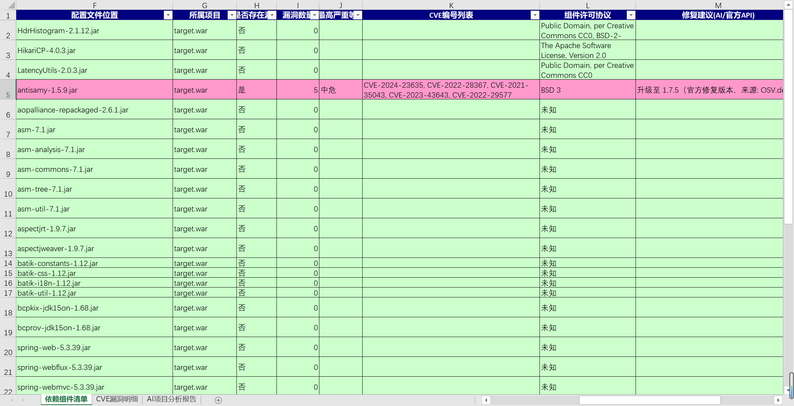
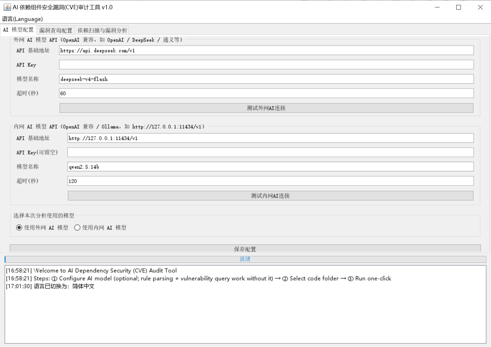
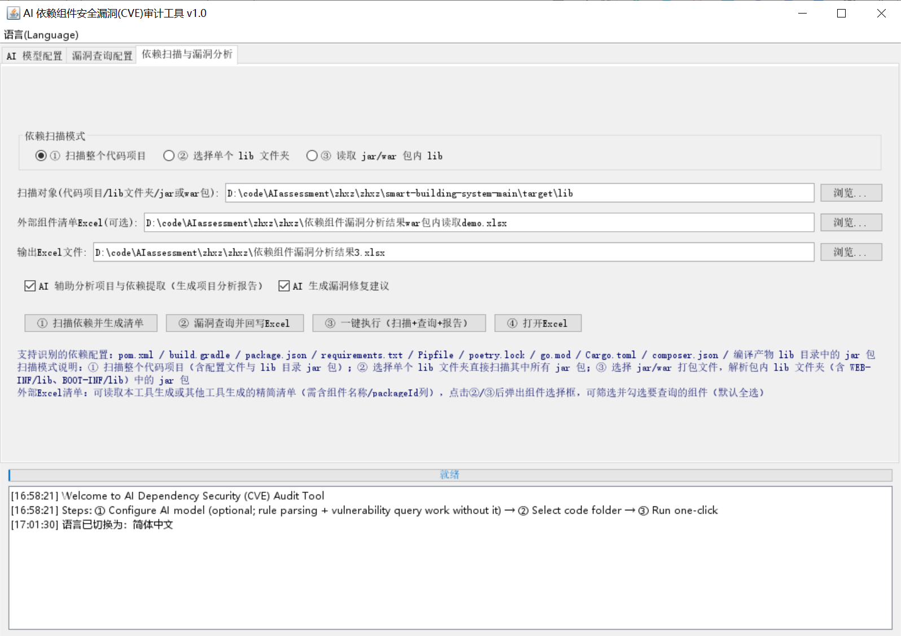
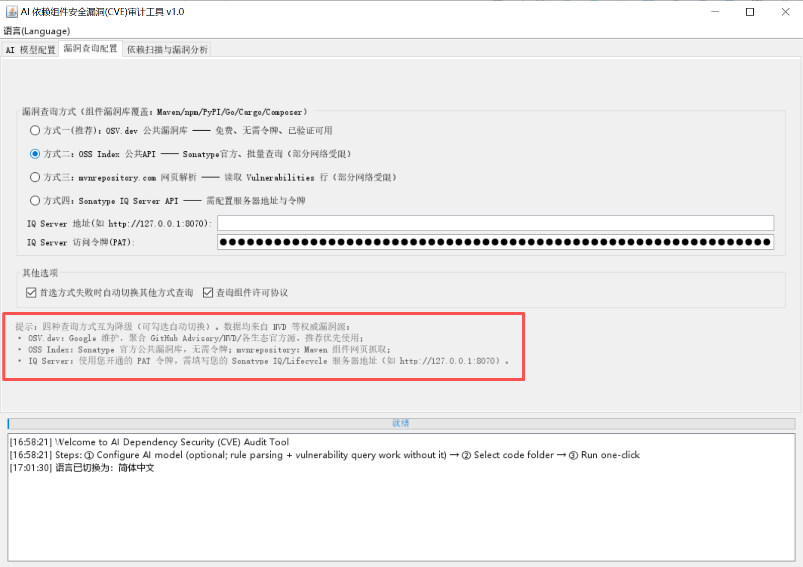
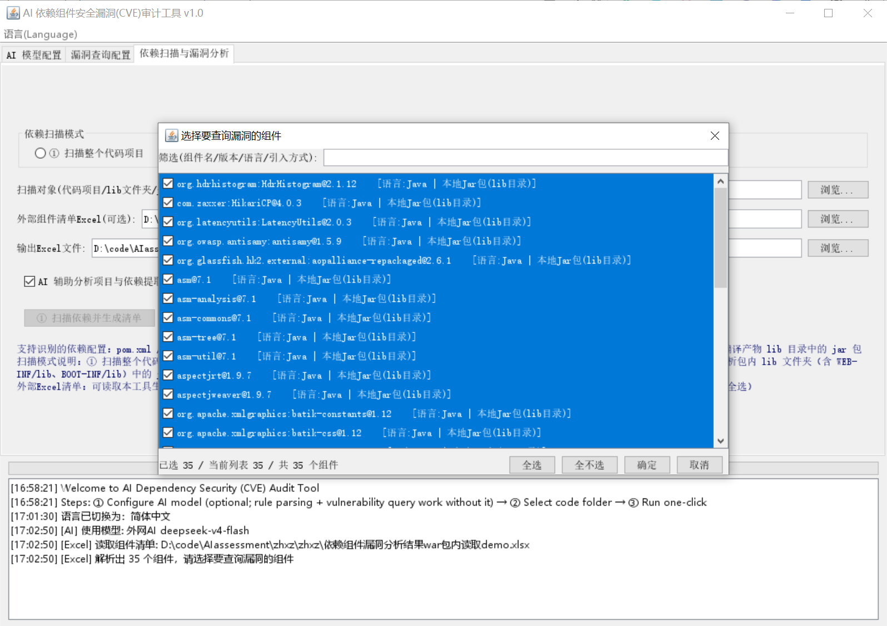
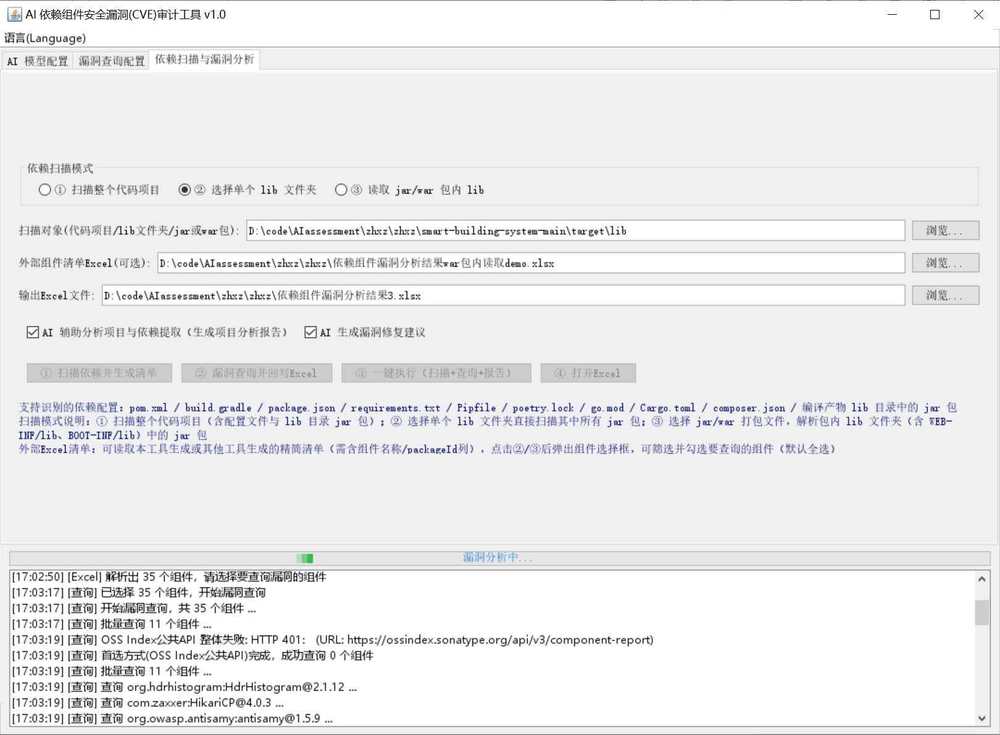
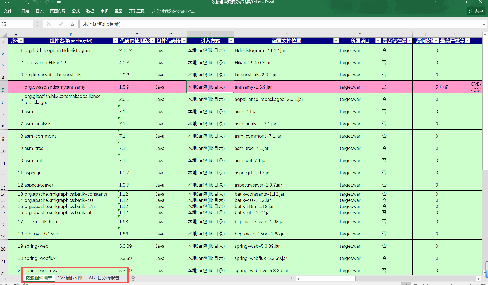

# 软件供应链开源组件成分漏洞安全扫描工具（Open Source Software SCA）

> **免费 · 开源 · AI 辅助的软件成分分析（SCA）工具**
>
> 🌐 **多语言 / Language / Langue / 言語**：[简体中文](README.md) · [English](README.en.md) · [Français](README.fr.md) · [日本語](README.ja.md)

一款完全免费、开源的软件成分分析（SCA）工具，使用 AI 辅助对软件供应链中的开源组件进行漏洞安全审计。通过 Swing 图形界面，选择 Java / Python / Node.js / Go / Rust / PHP 等语言的代码文件夹，自动识别并读取项目中的依赖组件配置（pom.xml、build.gradle、package.json、requirements.txt、poetry.lock、go.mod、Cargo.toml、composer.json、lib 目录下的 jar 包等），生成依赖组件 Excel 清单，并对所有组件逐一查询 CVE 漏洞与许可协议，将漏洞情况回写至 Excel，最终弹出完成提示框可直接打开 Excel 查看。

**支持中英法日四语言**：界面、日志打印、Excel 输出（工作表名/表头/状态值）均随所选语言（简体中文 / English / Français / 日本語）实时切换，语言选择自动持久化，下次启动自动恢复。

## 功能特性

- **多语言国际化（i18n）**：界面、日志、Excel 输出（工作表名/表头/状态值）支持四种语言，菜单栏「语言 / Language」一键切换，选择自动保存。
- **AI 模型 API 配置**：可分别配置「外网 AI 模型 API」与「内网 AI 模型 API」（OpenAI 兼容协议），支持任意 baseUrl / apiKey / 模型名，并支持一键测试连接。
- **AI 项目分析**：AI 读取代码文件夹目录结构与依赖清单，输出项目分析报告，并补充规则未覆盖的依赖组件。
- **三种依赖扫描模式**：
  1. **扫描整个代码项目**：自动识别依赖配置并提取「组件名(packageId) / 版本 / 语言 / 引入方式」：
     - Java：`pom.xml`（含 `${property}` 版本变量解析）、`build.gradle`、`lib` 目录下编译好的 jar 包（读取 META-INF/maven 的 pom.properties / pom.xml）
     - Node.js：`package.json`（dependencies / devDependencies 等）
     - Python：`requirements.txt`、`Pipfile`、`poetry.lock`
     - Go：`go.mod`；Rust：`Cargo.toml`；PHP：`composer.json`
  2. **选择单个 lib 文件夹**：直接扫描所选文件夹内的全部 jar 包。
  3. **读取 jar/war 打包文件**：解析包内 lib 文件夹（`WEB-INF/lib`、`BOOT-INF/lib`）中的 jar 包。
- **外部 Excel 组件清单**：可导入本工具生成或其他工具生成的组件清单 Excel（需含组件名称列），解析后弹出组件选择对话框，支持关键字筛选与勾选（默认全选）。
- **四种 CVE 漏洞查询通道**（可任选，失败自动降级）：
  1. **OSV.dev（推荐）**：Google 维护的公共漏洞库，免费无需令牌，聚合 GitHub Advisory / NVD 等权威源
  2. **OSS Index**：Sonatype 公共组件库（POST /api/v3/component-report）
  3. **mvnrepository**：按 `https://mvnrepository.com/artifact/{groupId}/{artifactId}/{version}` 网页规则解析 Vulnerabilities 表格
  4. **Sonatype IQ Server**：企业版 API（POST /api/v2/components/details），使用您提供的 PAT 令牌
- **漏洞信息回写 Excel**：是否存在漏洞、CVE 编号列表、最高严重等级（严重/高危/中危/低危）、每个漏洞的 CVSS 评分与修复版本范围、组件许可协议（Maven Central POM / npm registry / PyPI / crates.io / Packagist）。
- **AI 修复建议（官方 API 兜底）**：可选由 AI 为存在漏洞的组件生成升级修复建议；AI 不可用时自动改用漏洞查询 API 返回的官方修复版本建议；Excel 末列记录修复建议获取日期（接口读取日期），避免漏洞库后续更新导致修复版本变动后无法追溯建议的有效期。
- **完成提示框**：分析完成后弹出提示框，可选择「打开 Excel 查看 / 打开所在文件夹 / 关闭」。

## Excel 输出说明

生成的 Excel（`.xlsx`）包含 3 个工作表：

| 工作表 | 内容 |
| --- | --- |
| 依赖组件清单 | 组件名称(packageId)、版本、语言、引入方式、是否存在漏洞、漏洞数量、最高严重等级、CVE 编号列表、许可协议、AI 修复建议、官方 API 修复建议、修复建议获取日期、查询方式、状态（行按严重等级红/绿着色） |
| CVE漏洞明细 | 每个漏洞的 CVE 编号、标题、描述、CVSS 评分、严重等级、受影响的版本范围、参考链接 |
| AI项目分析报告 | AI 对项目的整体分析结论与修复建议 |
      

## 环境要求

- JDK 1.8 及以上（项目按 Java 8 语法编写）
- 无需安装 Maven 即可运行（使用已打包的 jar）；如需重新构建请安装 Maven 3.6+

## 快速开始

### 方式一：直接运行（推荐）

```bat
run.bat
```

或手动执行：

```bat
java -jar target\cve-dependency-scanner.jar
```

### 方式二：重新构建

```bat
mvn package -DskipTests
java -jar target\cve-dependency-scanner.jar
```

## 使用步骤

1. **AI 模型配置**（第一个标签页）：
   - 外网 AI：填写 OpenAI 兼容的 baseUrl（如 `https://api.openai.com/v1`）、apiKey、模型名（如 `gpt-4o-mini`）
   - 内网 AI：填写内网大模型服务地址（如 `http://127.0.0.1:11434/v1`，Ollama 可直接用 `qwen2.5:14b`）
   - 单选选择启用外网或内网，点击「测试连接」验证后「保存配置」
2. **漏洞查询配置**（第二个标签页）：
   - 选择查询方式（默认推荐 OSV.dev；其余方式按需选择）
   - 方式四（IQ Server）需填写服务器地址与 PAT 令牌
   - 可选：开启「自动降级」「许可协议解析」
3. **依赖扫描与漏洞分析**（第三个标签页）：
   - 选择扫描模式：① 扫描整个代码项目 / ② 选择单个 lib 文件夹 / ③ 读取 jar/war 包内 lib，并选择对应的扫描对象
   - 可选：导入外部组件清单 Excel、设置输出 Excel 路径
   - 可选勾选「AI 项目分析」「AI 修复建议」
   - 依次点击「① 扫描依赖并生成清单」→「② 漏洞查询并回写 Excel」→「③ 一键执行」（一键执行自动完成扫描 + 查询 + 报告）
4. 分析完成后自动弹出**完成提示框**，点击「打开 Excel 查看」即可查看漏洞清单。
5. **语言切换**：菜单栏「语言 / Language」随时切换简体中文 / English / Français / 日本語，界面、日志与 Excel 输出即时切换，选择自动保存。

## 配置说明

程序运行后会在 `config/app-config.json` 中持久化全部配置（关闭窗口时自动保存），包括：

| 配置项 | 说明 |
| --- | --- |
| language | 界面语言：zh / en / fr / ja |
| externalAi / internalAi | 外网/内网 AI 模型的 baseUrl、apiKey、model、超时秒数 |
| queryMethod | 查询方式：OSV / OSS_INDEX / MVN_REPO / IQ_SERVER |
| iqServerUrl / iqToken | Sonatype IQ Server 地址与令牌 |
| fallbackEnabled | 首选方式失败时是否自动降级到其他通道 |
| licenseEnabled | 是否解析组件许可协议 |
| aiAnalyze / aiFix | 是否启用 AI 项目分析 / AI 修复建议 |

## 目录结构

```
qcoder/
├── pom.xml                              # Maven 构建配置（打包可执行 jar）
├── run.bat                              # 一键启动脚本
├── config/app-config.json               # 运行时配置（自动保存，含语言选择）
├── README.md / README.en.md / README.fr.md / README.ja.md   # 多语言使用说明
└── src/main/
    ├── java/com/qcoder/cve/
    │   ├── Main.java                    # 程序入口
    │   ├── ui/MainFrame.java            # Swing 主界面（三标签页 + 语言菜单 + 完成提示框）
    │   ├── i18n/I18n.java               # 国际化工具类（语言切换/资源加载/状态值本地化）
    │   ├── config/                      # 配置模型与读写
    │   ├── model/                       # 依赖组件 / 漏洞明细模型
    │   ├── scan/DependencyScanner.java  # 多语言依赖扫描器（三种扫描模式）
    │   ├── cve/                         # 四种漏洞查询 + 许可协议解析 + purl 构造
    │   ├── ai/                          # 外网/内网 AI API 客户端与分析服务
    │   ├── excel/ExcelReport.java       # POI Excel 清单与漏洞回写（多语言输出）
    │   └── util/HttpUtil.java           # HTTP 工具
    └── resources/i18n/                  # 中/英/法/日四语言资源文件
```

## 技术栈

- JDK 1.8 + Swing（界面）、Apache POI 5.2.5（Excel）、Gson 2.10.1（JSON）、jsoup 1.17.2（网页解析）、Maven + shade 插件打包
- 自定义 i18n 框架：UTF-8 properties 资源文件，运行时无需重启切换，缺失键自动回退中文

## 开源许可

本项目基于 [GPL-3.0](LICENSE) 协议开源。
